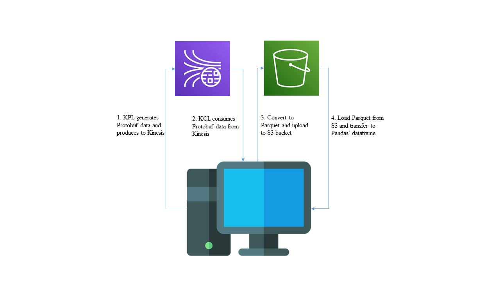

# Kinesis-Producer-and-Consumer-with-protobuf
## Overview
The repo is a practice of producing and consuming Protobuf data to and from Kinesis Data Stream. Beside, after consuming Protobuf, it will be converted into Parquet file then upload and read Parquet file to and from S3 Bucket.

## Introduction
In the Kinesis part, I used Java to implement the Producer and Consumer. There are many Java approaches to implement this part[1, 2]. In my approach, I used Kinesis Library to complete this implementation. Besides, when converting Protobuf to Parquet and uploading data to S3 Bucket, I used Java to finish it as well.

Regarding reading Parquet data from S3, I implemented by Python, which will use boto3 to connect with S3 Bucket and concat to a Pandas' dataframe.

In order to be convenient to deploy the AWS resource, you can download the Yaml file I wrote (Very simple) and use it on the CloudFormation. Just remember that you need to change the resource name, espacially S3 Bucket since it need to be globally unique.

Besides, in Producer and Consumer part, I used AWS Workshop[3] and doc[4] as references to finish the implementation. Therefore, if you have any confusion please have a look on those references that I attached bellow.

## Importance
Before starting to play with the code and AWS, remember to set the credential in either credential file or in your OS environment [5]. There are other ways to set the credential, but I prefere to use these two methods. If your using IntelliJ, you can set credentail file and load into IntelliJ (plugin the AWS tool first) so that your IntelliJ can interact with AWS. This is quite convenient to check whether your credential is correct or not.

## Data flow
1. KPL will produce Protobuf data and then send to kinesis.
2. KCL will consume Protobuf data from kinesis.
3. After consuming, program will convert Protobuf data into Parquet data and upload to S3.
4. Then, active the python code so that the Parquet data can be read and concat into one Pandas' dataframe.

 
    
 

 
## How to use
1. Use gradle to import the project in order to downlaod the dependencies via IDE.
2. In terms of Python environment, please use "pip install -r requirements.txt" command in the S3Parquet_Reader/S3ParquetReader folder (You are responsible to set up your own Python environment).
3. After downloading, you can either run the code via IDE or using gradle to build the project and use "java -cp package.ClassName" command to run the corresponding Java class.
4. Please run Consumer code first and wait for "Initializing @ Sequence:...." popping out. If you notice that Initializing words pop out (it may take some time), it means that your program successfully connect to Kinesis. If not, it means that there are some reasons which cause you cannot connect to Kinesis, namely wrong credential, wrong region, or wrong Kinesis Stream name etc. If you still cannot find the reason, I recommend you try to implement Java SDK approach by yourself since using API from Java SDK can show you what is the reason that you cannot connect to Kinesis (I do not know how to let KCL or KPL show the reason of unsuccessful connection. Therefore, I changed to implement by Java SDK and it showed the error message so that I finally found the reason why I cannot connect to Kinesis.)
5. After consumer successfully connecting to Kinesis, you can start to active the producer to send the Protobuf data.
6. Finally, you can find that your S3 Bucket has some data.
7. After you notice your S3 Bucket receive data, you can start to run Python code and then the dataframe will be present on the console.

## How to change to your own proto schema
1. Firstly, create a .proto in order to design your own data schema. 
2. After that, use protoc to generate the Java class for your Proto schema. (You are responsible to know how to generate the class)
3. Finally, change the corresponding Java code so that you can use your own data schema

## Reference
1. https://docs.aws.amazon.com/streams/latest/dev/building-producers.html
2. https://docs.aws.amazon.com/streams/latest/dev/building-consumers.html
3. https://catalog.us-east-1.prod.workshops.aws/workshops/2300137e-f2ac-4eb9-a4ac-3d25026b235f/en-US
4. https://aws.amazon.com/tw/blogs/big-data/introducing-protocol-buffers-protobuf-schema-support-in-amazon-glue-schema-registry/
5. https://docs.aws.amazon.com/sdk-for-java/v1/developer-guide/setup-credentials.html
